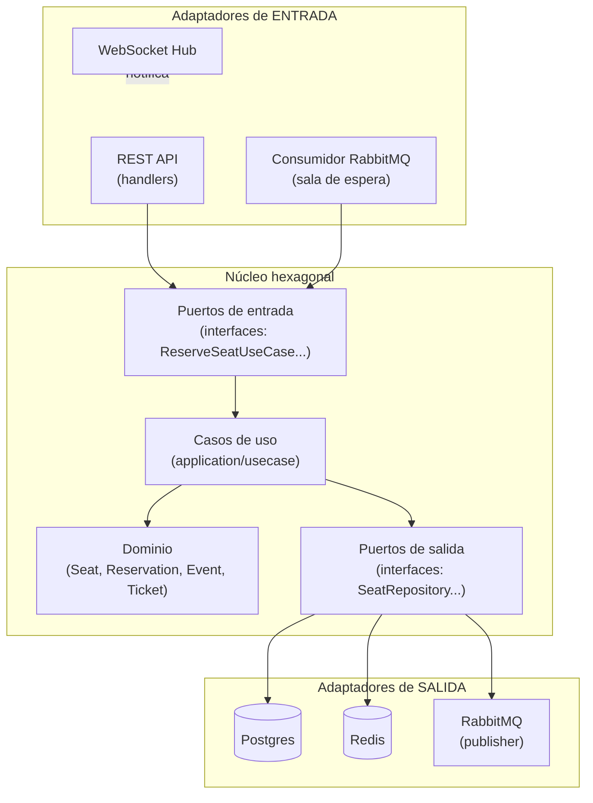
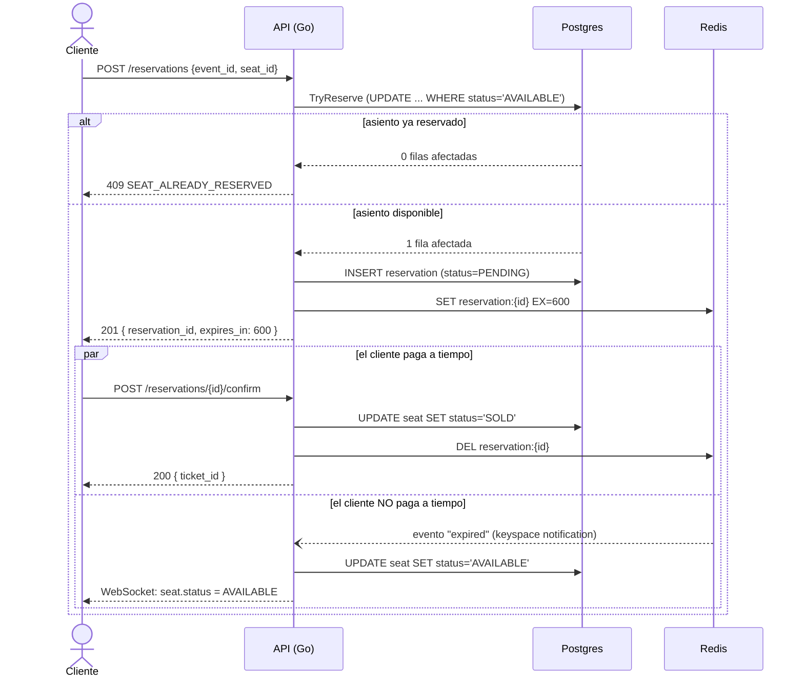

# Arquitectura

Arquitectura Hexagonal (Puertos y Adaptadores) + Domain-Driven Design.

## Principio

Las reglas de negocio (`domain`) no dependen de ningún framework, driver
de base de datos, ni protocolo de red. Todo lo externo se comunica con
el núcleo a través de **interfaces (puertos)**, y cada tecnología
concreta (Postgres, Redis, RabbitMQ, HTTP, WebSocket) es un
**adaptador** intercambiable que implementa esos puertos.



## Regla de dependencias

```
adapters  →  application  →  domain
   (nunca al revés)
```

- `domain` no importa nada fuera de Go estándar.
- `application` solo importa `domain` y define interfaces (`port/in`, `port/out`).
- `adapters` implementa esas interfaces con tecnología concreta.
- `cmd/api/main.go` es el único punto que conoce todas las capas a la vez (composition root / inyección de dependencias manual).

## Estructura de carpetas

```
api/
├── cmd/api/main.go              # composition root
├── internal/
│   ├── domain/                  # entidades + reglas de negocio puras
│   │   ├── seat/                # Seat: AVAILABLE -> RESERVED -> SOLD
│   │   ├── reservation/         # Reservation + TTL de 10 min
│   │   ├── event/
│   │   ├── ticket/
│   │   └── shared/               # Value Objects (ID) + DomainError
│   ├── application/
│   │   ├── port/in/             # interfaces de casos de uso
│   │   ├── port/out/            # interfaces hacia infraestructura
│   │   └── usecase/             # implementación de los casos de uso
│   └── adapters/
│       ├── in/http/             # REST (handlers, middleware, dto)
│       ├── in/websocket/        # tiempo real
│       ├── in/amqpconsumer/     # sala de espera virtual
│       └── out/{postgres,redis,rabbitmq}/
└── openapi.yaml
```

## Flujo de negocio: Reservar → Esperar 10 min → Pagar



Este mismo diagrama debería vivir también en el `README.md` principal
del repo (ver punto 4 del checklist de documentación).
