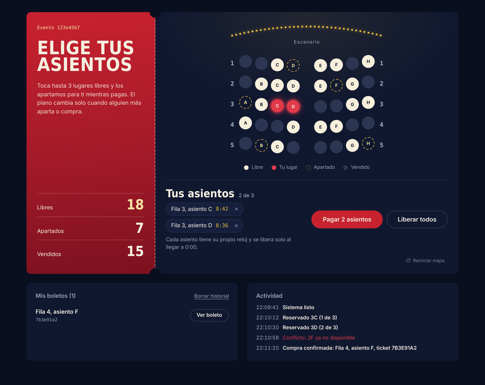
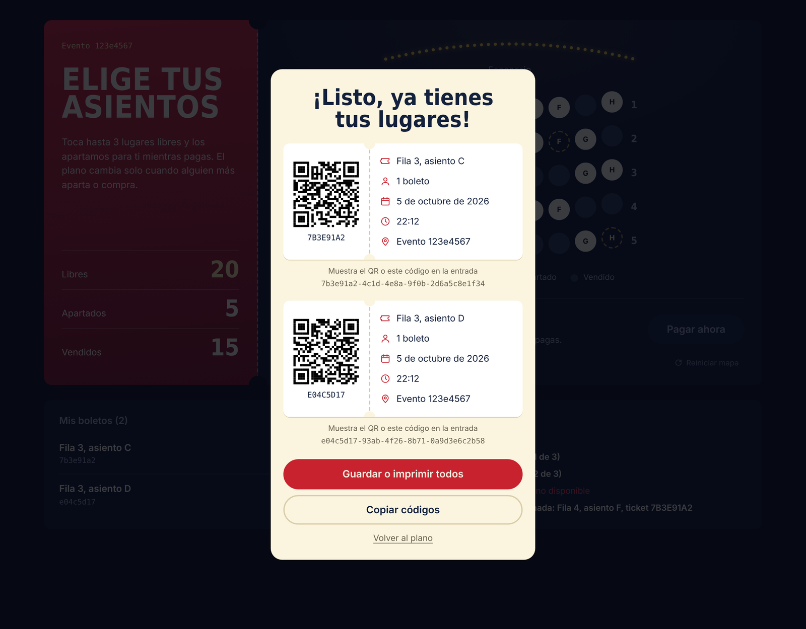
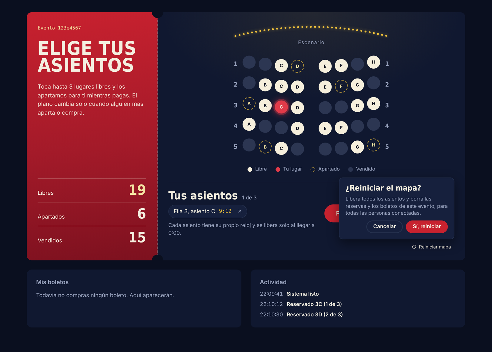
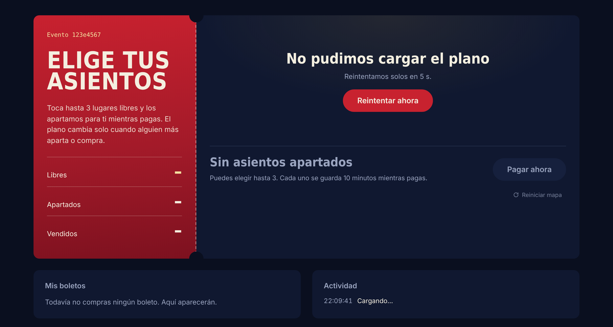
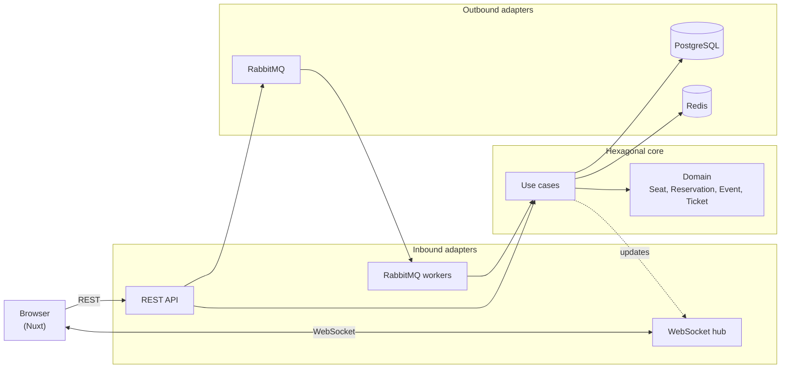
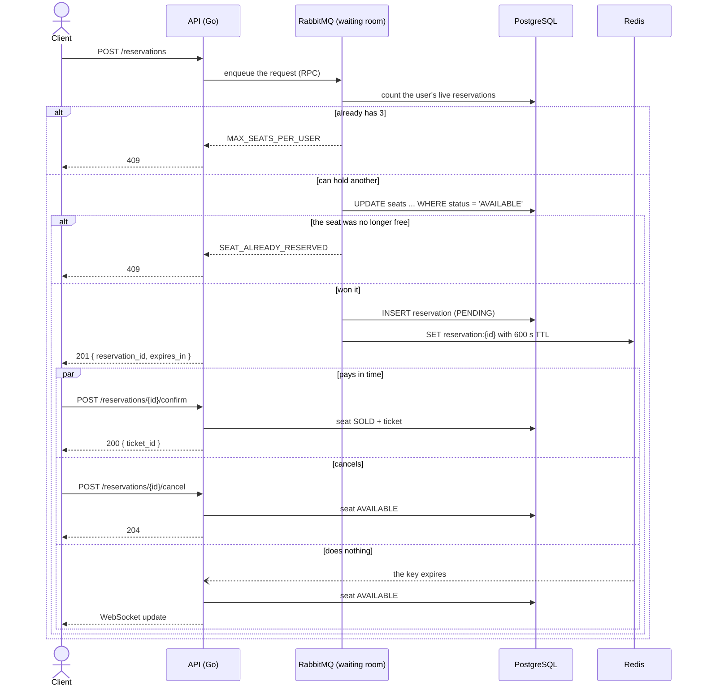
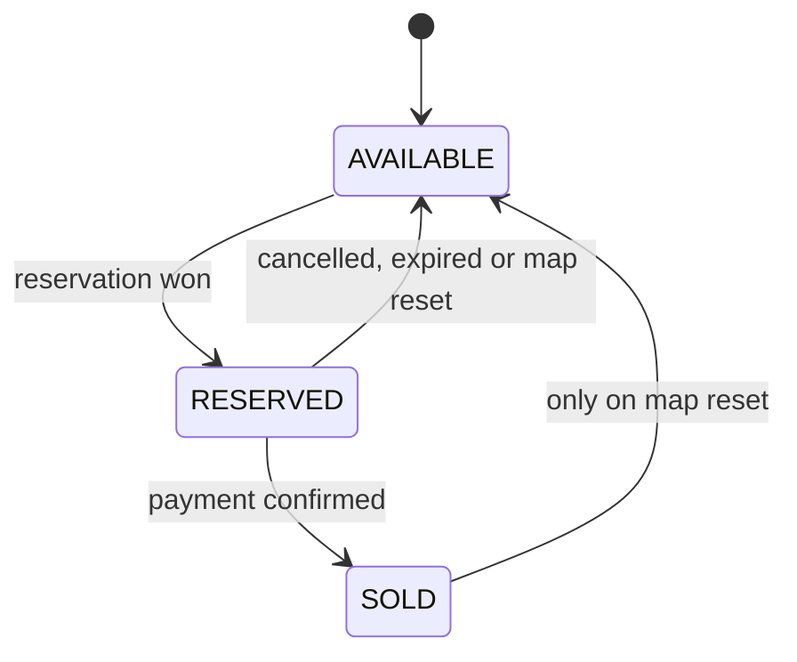

# SDV

[Español](README.md) | **English**

Ticketing system with a real-time seat map. The Go API decides, under real concurrency,
who gets each seat: a reservation is an atomic PostgreSQL operation, so **a seat is never
sold twice**, even when a thousand people tap it at once. Each reservation lasts 10 minutes
(Redis), requests go through a virtual waiting room (RabbitMQ), and every open browser sees
the plan change over WebSocket, no reload needed.



| One QR ticket per seat | Reset the map | No connection to the server |
| --- | --- | --- |
|  |  |  |

The interface is in Spanish.

## Try it in a few minutes

With Go, Node, pnpm and Podman installed:

```bash
git clone https://github.com/carlosmorales-dev-mx/ticketing-system.git
cd ticketing-system
cp deploy/.env.example deploy/.env
make tidy
make frontend-install
make dev-full
```

`make dev-full` starts PostgreSQL, Redis, RabbitMQ and Swagger UI, then the API and the
frontend together in the same terminal. Open
`http://localhost:3000/events/123e4567-e89b-12d3-a456-426614174000`: the development
migration already seeded an event with 40 seats. Open a second tab and watch whatever you
hold show up instantly in the other one.

## Overview

SDV splits responsibilities into pieces that only talk through interfaces:

- The **API** (Go) is the only thing that talks to PostgreSQL and Redis. It validates,
  reserves, confirms, releases and broadcasts every seat change to connected browsers.
- A **worker pool** consumes the RabbitMQ queue and runs reservations against the database
  at a controlled pace. The number of workers is the real width of the "door" into
  PostgreSQL: a burst of requests waits in the queue instead of hammering the database.
- The **frontend** (Nuxt) draws the plan and stays up to date over WebSocket.

## Features

- Live venue plan: each seat is a dot, rows curve toward the stage, and the state changes by
  itself when someone else holds, pays for or releases a seat.
- **Up to 3 seats per person.** Each seat is its own reservation with its own 10-minute
  clock: pay for them all with one button ("Pagar 3 asientos") or release them one by one.
  The backend enforces the limit (`MAX_SEATS_PER_USER`), not just the UI.
- **Zero double-selling**, guaranteed by a single SQL statement and reinforced by a partial
  unique index (see "Design decisions").
- Automatic expiry after 10 minutes: Redis notifies when a reservation lapses, and a
  periodic sweep against Postgres covers any notification that gets lost.
- **QR-code ticket** per seat, ready to save as PDF or print.
- If the plan fails to load, the UI says so, retries by itself with growing waits, and offers
  a "Reintentar ahora" button.
- **Reset map** button (a development tool, off by default on the server): returns the event
  to its freshly seeded state and clears the plan in every open browser.
- Active reservations survive a page reload, each clock following its real remaining time.
- Documented API contract (OpenAPI + Swagger UI) and a per-IP rate limit.

## Architecture



How a reservation travels, from the tap on a seat until it is paid, cancelled or expires:



Seat states:



The domain imports nothing from PostgreSQL, Redis, RabbitMQ or HTTP: everything external goes
in and out through interfaces (ports), and `api/cmd/api/main.go` is the only place that
knows every piece. More in [`ARCHITECTURE.md`](./ARCHITECTURE.md).

## Tech stack

| Layer | Technology |
| --- | --- |
| Frontend | Nuxt 3, Vue 3, TypeScript, pnpm, `qrcode-generator` |
| API | Go 1.22, `net/http` (ServeMux with method and path patterns), gorilla/websocket |
| Database | PostgreSQL 16 (pgx v5) |
| Reservation TTL | Redis 7 (key-expiry notifications) |
| Messaging | RabbitMQ 3.13 (RPC + 5 workers) |
| Containers | Podman (`podman-compose`) |
| Docs | OpenAPI 3 and Swagger UI |

## Getting started

### Requirements

- Go 1.22 or newer
- Node.js 20 or newer and [pnpm](https://pnpm.io)
- [Podman](https://podman.io) and `podman-compose`
- `jq`, only for `make smoke-test`

### Local development

```bash
git clone https://github.com/carlosmorales-dev-mx/ticketing-system.git
cd ticketing-system
cp deploy/.env.example deploy/.env
make up                 # PostgreSQL + Redis + RabbitMQ + Swagger UI
make tidy               # Go dependencies
make frontend-install   # frontend dependencies
make dev-full           # API + frontend together
```

- Frontend: `http://localhost:3000`
- API: `http://localhost:8080`
- Swagger UI: `http://localhost:8081`
- RabbitMQ panel: `http://localhost:15672` (`ticketing` / `ticketing_dev_password`)

`Ctrl+C` stops the API and the frontend together; the infrastructure keeps running until
`make down`. Each piece also runs on its own: `make run` (API) and `make frontend-dev`
(Nuxt) in separate terminals. `make help` lists every command.

### Everything in containers

```bash
make up-full    # builds and starts infrastructure, API and frontend
make down-full  # stops the API and the frontend
```

The containerized API starts with the map reset **off** (`ENABLE_MAP_RESET=false`).

## Configuration

Every API variable has a default that works for local development.

### API

| Variable | Default | What it does |
| --- | --- | --- |
| `API_PORT` | `8080` | HTTP port. |
| `DATABASE_URL` | local dev Postgres | PostgreSQL connection string. |
| `REDIS_ADDR` | `localhost:6379` | Redis address. |
| `RABBITMQ_URL` | local dev RabbitMQ | RabbitMQ connection. |
| `RESERVATION_WORKERS` | `5` | Waiting-room workers: how many reservations hit Postgres at once. |
| `SWEEP_INTERVAL_SECONDS` | `30` | How often expired reservations that Redis missed are looked up. |
| `ALLOWED_ORIGINS` | `http://localhost:3000` | CORS-allowed origins, comma separated. |
| `ENABLE_MAP_RESET` | `false` | Enables `POST /events/{id}/reset`. `make run` and `make dev-full` turn it on; `make dev-full ENABLE_MAP_RESET=false` leaves it off. |

### Frontend

| Variable | Default | What it does |
| --- | --- | --- |
| `NUXT_PUBLIC_API_BASE` | `http://localhost:8080` | API address. |
| `NUXT_PUBLIC_WS_BASE` | `ws://localhost:8080` | WebSocket address. |
| `NUXT_PUBLIC_ENABLE_RESET` | visible in development only | `true` or `false` shows or hides the "Reiniciar mapa" button. |

## API

The full contract, with examples and edge cases, is in [`api/openapi.yaml`](./api/openapi.yaml)
and Swagger UI.

| Method | Path | Description |
| --- | --- | --- |
| `GET` | `/health` | PostgreSQL, Redis and RabbitMQ status. |
| `GET` | `/events/{id}/seats` | Event seats with their current state. |
| `POST` | `/reservations` | Holds a seat for 10 minutes (`201`, `400`, `409`, `429`). |
| `POST` | `/reservations/{id}/confirm` | Pays and issues the ticket (`200`, `404`, `409`). |
| `POST` | `/reservations/{id}/cancel` | Releases your own reservation (`204`, `404`, `409`). |
| `POST` | `/events/{id}/reset` | Resets the map. Only with `ENABLE_MAP_RESET=true` (`200`, `403`, `404`). |
| `WS` | `/ws/events/{id}` | Real-time seat changes. |

Errors share one format, `{"error": "CODE"}`, with stable codes such as
`SEAT_ALREADY_RESERVED`, `MAX_SEATS_PER_USER`, `RESERVATION_NOT_PENDING`, `EVENT_NOT_FOUND`,
`MAP_RESET_DISABLED` and `RATE_LIMITED`. The API limits each IP to 15 requests per second,
with bursts of up to 30.

## Tests and quality

```bash
make test         # go test -race -cover ./...
make smoke-test   # 15 concurrent reservations on the same seat (with the API running)
make lint         # gofmt + go vet
```

Domain and use-case tests use in-memory implementations of the ports: the anti-double-sale
rule, the 3-seat limit and the map reset are tested without starting PostgreSQL, Redis or
RabbitMQ. `make smoke-test` proves the guarantee end to end: it fires the reservations in
parallel, checks that exactly one wins (`201`), confirms its payment and verifies the seat
ends up `SOLD`.

## Troubleshooting

| Symptom | Likely cause | Fix |
| --- | --- | --- |
| "No pudimos cargar el plano" | The API or the infrastructure isn't running | `make dev-full` (or `make ps` to see the containers) |
| `Cannot find package 'qrcode-generator'` | The ticket dependency isn't installed | `cd frontend && pnpm install` |
| Nuxt says port 3000 is in use, or the API says 8080 is | Another dev server is running | Stop the other `make dev-full` or `pnpm dev` with `Ctrl+C` |
| Reserving shows "Solo puedes apartar hasta 3 asientos" | You already hold 3 live reservations for this event | Pay for or release one |
| The "Reiniciar mapa" button says the reset is off | The API started without `ENABLE_MAP_RESET=true` | Start it with `make run` or `make dev-full` |
| `make smoke-test` fails right away | `jq` is missing, or the API isn't running | Install `jq` and run `make dev-full` in another terminal |
| `429 RATE_LIMITED` on some smoke-test reservations | The per-IP limit at work | Expected: the rest of the requests get `409` |
| I changed a migration and nothing happened | Migrations only run when the PostgreSQL volume is created | `make db-reset` (or `make reset` to wipe all data) |
| The map looks empty or shows old seats after resetting the database | The browser still stores reservations and tickets from the previous event | Use the "Reiniciar mapa" button, which also clears what the browser stored |
| `short-name "postgres:16-alpine" did not resolve to an alias` | Podman needs the full image name | Use `docker.io/library/postgres:16-alpine`, as `podman-compose.yaml` does |

## Project structure

```
.
├── api
│   ├── cmd/api/main.go                  composition root: wires every piece together
│   ├── internal
│   │   ├── domain/                      pure rules: seat, reservation, event, ticket, shared
│   │   ├── application
│   │   │   ├── port/in, port/out        use-case and infrastructure interfaces
│   │   │   └── usecase/                 reserve, confirm, cancel, expire, reset
│   │   └── adapters
│   │       ├── in/http, in/websocket    REST, middleware and the real-time hub
│   │       ├── in/amqpconsumer          waiting-room workers
│   │       └── out/postgres, redis, rabbitmq
│   ├── pkg/config/                      configuration from environment variables
│   ├── openapi.yaml                     API contract
│   └── Containerfile
├── frontend
│   ├── pages/events/[id].vue            the map screen
│   ├── components/                      plan, seats, reservations, ticket, reset
│   ├── composables/                     API, WebSocket, active reservations, history
│   └── assets/main.css                  design tokens
├── migrations/                          schema and seed data
├── deploy/                              podman-compose and Swagger UI
├── scripts/smoke_test.sh                concurrency test
├── docs/img                             screenshots
└── Makefile
```

## Design decisions

- **Mutual exclusion lives in a single SQL statement.** `UPDATE seats SET status =
  'RESERVED' WHERE id = $1 AND status = 'AVAILABLE'` is atomic per row: if two requests
  arrive together, PostgreSQL lets one through (`1 row affected`) and the other gets `0`.
  It is simpler and less deadlock-prone than a `SELECT ... FOR UPDATE` followed by an
  `UPDATE`. On top of that, a partial unique index (`uq_seat_pending_reservation`) makes it
  structurally impossible to have two `PENDING` reservations on the same seat.
- **Reservations go through a real waiting room.** The API enqueues each request in RabbitMQ
  (RPC) and a fixed pool of workers, with `prefetch=1`, runs it. A decorative publisher
  would limit nothing; here the number of workers is the width of the door into the database.
- **The TTL has two mechanisms.** Redis notifies when a reservation key expires, but those
  notifications are best-effort (they are lost if Redis restarts). So a periodic sweep
  queries PostgreSQL for expired reservations, backed by a partial index on `expires_at`.
- **Each seat is its own reservation.** With several seats per person a "group reservation"
  could have been modeled, but that forces a decision about what happens when one of the
  seats lapses. With one reservation per seat each keeps its own clock, confirmation and
  release, and the domain didn't change.
- **The limit of 3 is enforced on the server.** The use case counts the user's live
  reservations before touching the seat. A per-user lock (striped over 64 mutexes, fixed
  size) stops the 5 workers from processing four of their requests at once and skipping the cap.
- **The WebSocket hub serializes writes per connection.** The library doesn't allow
  concurrent writes on one connection, and a map reset sends dozens of messages in a burst
  while other reservations also publish. Each connection has its own write lock and a
  deadline, so one slow tab doesn't hold back the others.
- **The map reset is a single transaction and is off by default.** It deletes the event's
  reservations (tickets cascade), returns every seat to `AVAILABLE` and, once committed,
  clears Redis and notifies seat by seat. If the tool isn't enabled, the endpoint answers
  `403` and runs nothing.
- **The UI uses a single clock.** All active reservations are computed against an absolute
  expiry time and one one-second timer, so adding seats adds no intervals, and reloading the
  page doesn't reset the counters.

## Known limitations

- There are no user accounts. Identity is a UUID stored in the browser, so the 3-seat cap can
  be bypassed by clearing local storage. A real cap needs authentication.
- The per-user limit lock protects within **one** API instance. With several replicas it
  would need an atomic count in the database.
- "Payment" is simulated: confirming a reservation issues the ticket without a payment gateway.
- The plan shows the event id, not its name, venue and date: they are in the database, but
  there is no endpoint that exposes them yet.
- If the WebSocket drops and reconnects, the plan doesn't resync by itself until the next
  update or reload.
- There is no CI yet; tests run with `make test`.

## Author

Carlos Morales -- [cmorales.dev](https://cmorales.dev)
