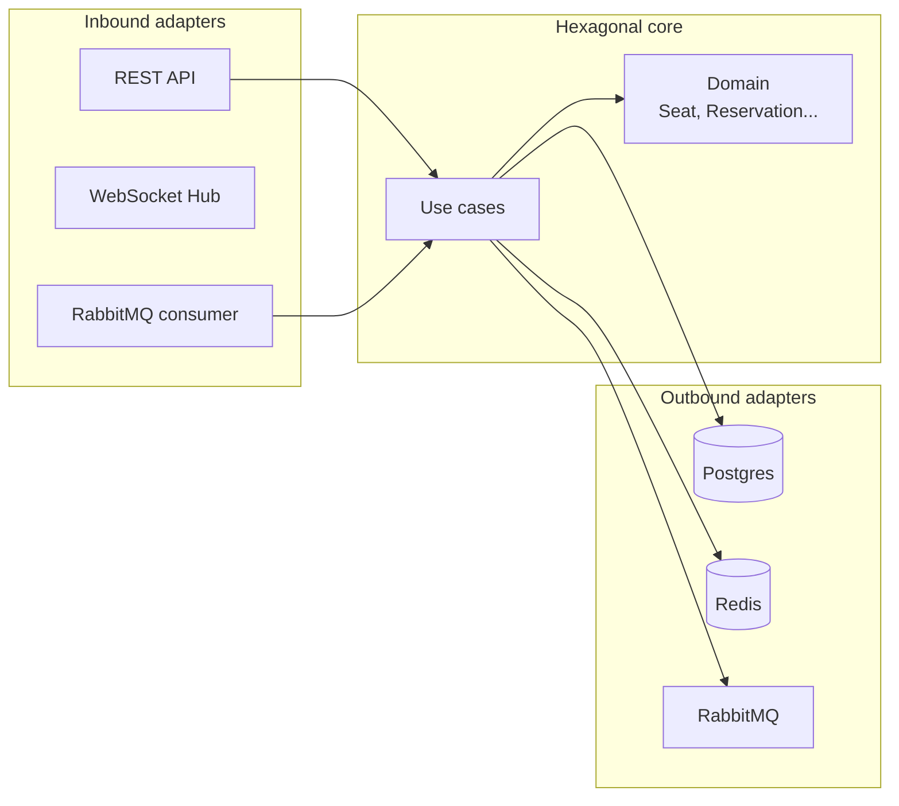
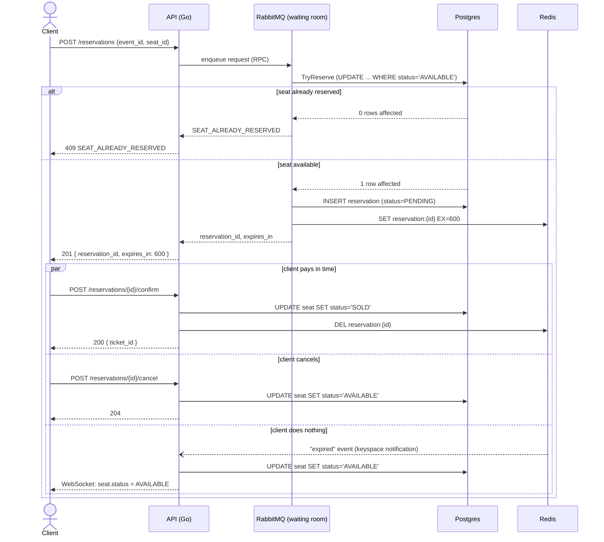

# High-Concurrency Ticket Sales System

[Español](./README.md) ·  English

Ticket sales system built in Go with hexagonal architecture (DDD). PostgreSQL with atomic transactional locks guarantees that **a seat is never sold twice**, even under real concurrent load. Redis handles the 10-minute TTL for each reservation, RabbitMQ acts as a real virtual waiting room (with workers actually consuming the queue, not just a decorative publisher), and WebSockets notify seat changes in real time. Frontend built in Nuxt with an interactive seat map.

## Stack

| Layer | Technology | Why |
|---|---|---|
| API | Go (Golang) | Native concurrency — the standard at companies like Glovo or Cabify for this kind of system |
| Database | PostgreSQL | Strict transactional locks: a real no-double-sale guarantee |
| Cache / TTL | Redis | Automatically releases a seat if it isn't paid for within 10 minutes |
| Messaging | RabbitMQ | Virtual waiting room: a worker pool processes reservations at a controlled rate instead of every request hitting Postgres directly |
| Infrastructure | Podman | The whole stack orchestrated with containers (`Containerfile`, not Docker) |
| Documentation | OpenAPI + Swagger UI | Interactive, testable API contract in the browser |
| Frontend | Nuxt + pnpm | Real-time seat map over WebSockets, cyberpunk/neobrutalist look |

## Architecture

Hexagonal architecture (ports and adapters): the domain (`Seat`, `Reservation`, `Event`, `Ticket`) doesn't depend on Postgres, Redis, RabbitMQ, or HTTP — everything external goes through interfaces.



Full breakdown of layers and folder structure: [`ARCHITECTURE.md`](./ARCHITECTURE.md) (currently in Spanish).

## Business flow: Reserve → Wait 10 min → Pay (or cancel)



## Getting started

### Option A — development (backend and frontend separately, with hot-reload)

```bash
git clone https://github.com/carlosmorales-dev-mx/ticketing-system.git
cd ticketing-system

cp deploy/.env.example deploy/.env
make up                 # Postgres + Redis + RabbitMQ + Swagger UI
make tidy                # Go dependencies
make frontend-install    # frontend dependencies (pnpm)

make dev-full            # backend + frontend together, one command/terminal
```

`make dev-full` runs `go run` and `pnpm dev` in parallel in the same terminal — `Ctrl+C` stops both at once. If you'd rather see them in separate terminals: `make run` in one and `make frontend-dev` in another.

- API: **http://localhost:8080**
- Frontend: **http://localhost:3000**
- Swagger UI: **http://localhost:8081**

### Option B — fully containerized (one-command demo)

```bash
make up-full   # builds and starts infra + API + frontend, all in Podman containers
```

## Testing the anti-double-sale guarantee

With the backend running (`make run` or `make dev-full`):

```bash
make smoke-test
```

Fires 15 **concurrent** reservation requests against the same seat and verifies exactly one wins (`201`) while the rest get `409 SEAT_ALREADY_RESERVED` or `429` (rate limiting). It then confirms the payment and validates the seat ends up in `SOLD` status.

## Tests

```bash
make test   # go test -race -cover ./...
```

Unit tests for the domain (`Seat.Reserve`, `Reservation.IsExpired`...) and for the `ReserveSeat` use case with in-memory fakes — the hexagonal architecture makes it possible to test the anti-double-sale rule without spinning up Postgres.

## Additional documentation

- [`ARCHITECTURE.md`](./ARCHITECTURE.md) — folder structure, hexagonal layers, dependency rule (Spanish)
- [`api/openapi.yaml`](./api/openapi.yaml) — full API contract, edge cases (`400`/`409`/`429`) and examples
- [`deploy/README.md`](./deploy/README.md) — infrastructure, access points and environment variables (Spanish)
