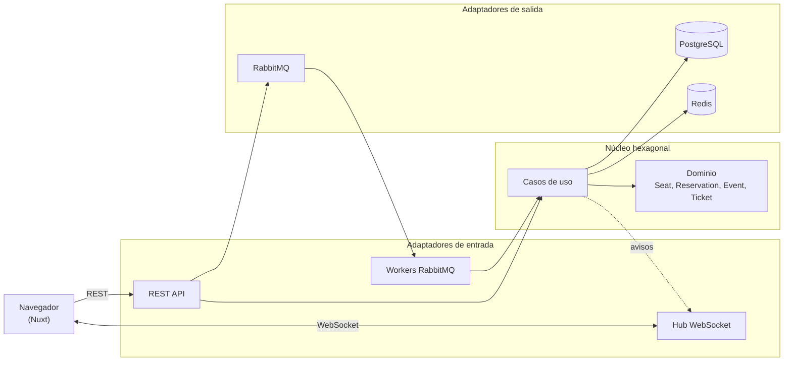
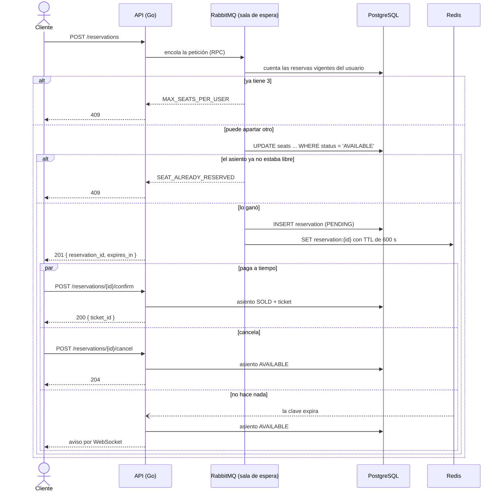
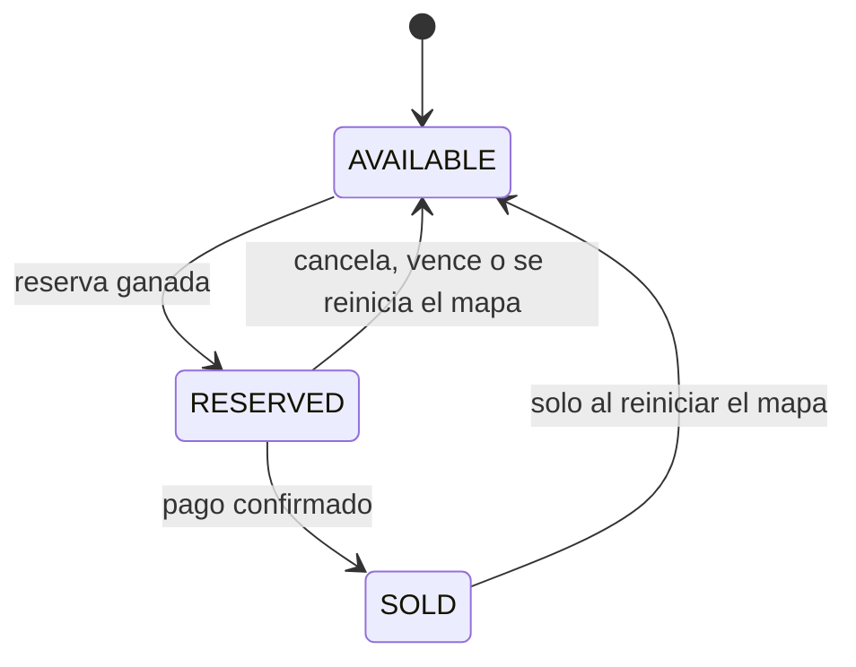

# SDV

**Español** | [English](README.en.md)

Sistema de venta de entradas con mapa de asientos en tiempo real. La API en Go decide,
bajo concurrencia real, quién se queda con cada asiento: una reserva es una operación
atómica en PostgreSQL, así que **un asiento jamás se vende dos veces**, aunque lo toquen
mil personas a la vez. Cada reserva dura 10 minutos (Redis), las peticiones pasan por una
sala de espera virtual (RabbitMQ) y todos los navegadores abiertos ven cambiar el plano
por WebSocket, sin recargar.


| Boleto con QR por asiento | Reiniciar el mapa | Sin conexión con el servidor |
| --- | --- | --- |
|  |  |  |

## Pruébalo en pocos minutos

Con Go, Node, pnpm y Podman instalados:

```bash
git clone https://github.com/carlosmorales-dev-mx/ticketing-system.git
cd ticketing-system
cp deploy/.env.example deploy/.env
make tidy
make frontend-install
make dev-full
```

`make dev-full` levanta PostgreSQL, Redis, RabbitMQ y Swagger UI, y luego la API y el
frontend juntos en la misma terminal. Abre
`http://localhost:3000/events/123e4567-e89b-12d3-a456-426614174000`: la migración de
desarrollo ya sembró un evento con 40 asientos. Abre una segunda pestaña y verás cómo lo
que aparta una aparece al instante en la otra.

## Visión general

SDV separa las responsabilidades en piezas que solo se hablan por interfaces:

- La **API** (Go) es la única que habla con PostgreSQL y Redis. Valida, reserva, confirma,
  libera y transmite cada cambio de asiento a los navegadores conectados.
- Un **pool de workers** consume la cola de RabbitMQ y ejecuta las reservas contra la base
  a un ritmo controlado. El número de workers es el ancho real de la «puerta» hacia
  PostgreSQL: una ráfaga de peticiones espera en la cola en vez de golpear la base.
- El **frontend** (Nuxt) dibuja el plano y se mantiene al día por WebSocket.

## Características

- Plano de sala en vivo: cada asiento es un punto, las filas se curvan hacia el escenario y
  el estado cambia solo cuando alguien más aparta, paga o libera.
- **Hasta 3 asientos por persona.** Cada asiento es su propia reserva con su propio reloj de
  10 minutos: se pagan juntos con un botón («Pagar 3 asientos») o se liberan uno por uno.
  El límite lo valida el backend (`MAX_SEATS_PER_USER`), no solo la interfaz.
- **Cero doble venta**, garantizada por una sola sentencia SQL y reforzada por un índice
  único parcial (ver «Decisiones de diseño»).
- Expiración automática a los 10 minutos: Redis avisa cuando vence una reserva y un barrido
  periódico contra Postgres cubre los avisos que se pierdan.
- Boleto con **código QR** por asiento, listo para guardar como PDF o imprimir.
- Si el plano no carga, la interfaz lo dice, reintenta sola con espera creciente y ofrece un
  botón «Reintentar ahora».
- Botón **Reiniciar mapa** (herramienta de desarrollo, apagada por defecto en el servidor):
  deja el evento como recién sembrado y limpia el plano de todos los navegadores abiertos.
- Las reservas activas sobreviven a recargar la página, con cada reloj siguiendo su tiempo
  real restante.
- Contrato de API documentado con OpenAPI y Swagger UI, y límite de peticiones por IP.

## Arquitectura



Cómo viaja una reserva, desde que se toca el asiento hasta que se paga, se cancela o vence:



Estados de un asiento:



El dominio no importa PostgreSQL, Redis, RabbitMQ ni HTTP: todo lo externo entra y sale por
interfaces (puertos), y `api/cmd/api/main.go` es el único lugar que conoce todas las piezas.
Más detalle en [`ARCHITECTURE.md`](./ARCHITECTURE.md).

## Tecnologías

| Capa | Tecnología |
| --- | --- |
| Frontend | Nuxt 3, Vue 3, TypeScript, pnpm, `qrcode-generator` |
| API | Go 1.22, `net/http` (ServeMux con patrones de método y ruta), gorilla/websocket |
| Base de datos | PostgreSQL 16 (pgx v5) |
| TTL de reservas | Redis 7 (notificaciones de expiración de claves) |
| Mensajería | RabbitMQ 3.13 (RPC + 5 workers) |
| Contenedores | Podman (`podman-compose`) |
| Documentación | OpenAPI 3 y Swagger UI |

## Primeros pasos

### Requisitos

- Go 1.22 o más reciente
- Node.js 20 o más reciente y [pnpm](https://pnpm.io)
- [Podman](https://podman.io) y `podman-compose`
- `jq`, solo para `make smoke-test`

### Desarrollo local

```bash
git clone https://github.com/carlosmorales-dev-mx/ticketing-system.git
cd ticketing-system
cp deploy/.env.example deploy/.env
make up                 # PostgreSQL + Redis + RabbitMQ + Swagger UI
make tidy               # dependencias de Go
make frontend-install   # dependencias del frontend
make dev-full           # API + frontend juntos
```

- Frontend: `http://localhost:3000`
- API: `http://localhost:8080`
- Swagger UI: `http://localhost:8081`
- Panel de RabbitMQ: `http://localhost:15672` (`ticketing` / `ticketing_dev_password`)

`Ctrl+C` detiene la API y el frontend a la vez; la infraestructura sigue corriendo hasta
`make down`. Cada pieza también corre por separado: `make run` (API) y `make frontend-dev`
(Nuxt) en terminales distintas. `make help` lista todos los comandos.

### Todo en contenedores

```bash
make up-full    # construye y levanta infraestructura, API y frontend
make down-full  # detiene la API y el frontend
```

La API en contenedor arranca con el reinicio de mapa **apagado** (`ENABLE_MAP_RESET=false`).

## Configuración

Todas las variables de la API tienen un valor por defecto que sirve en desarrollo local.

### API

| Variable | Por defecto | Qué hace |
| --- | --- | --- |
| `API_PORT` | `8080` | Puerto HTTP. |
| `DATABASE_URL` | Postgres local de desarrollo | Cadena de conexión a PostgreSQL. |
| `REDIS_ADDR` | `localhost:6379` | Dirección de Redis. |
| `RABBITMQ_URL` | RabbitMQ local de desarrollo | Conexión a RabbitMQ. |
| `RESERVATION_WORKERS` | `5` | Workers de la sala de espera: cuántas reservas tocan Postgres a la vez. |
| `SWEEP_INTERVAL_SECONDS` | `30` | Cada cuánto se buscan reservas vencidas que Redis no avisó. |
| `ALLOWED_ORIGINS` | `http://localhost:3000` | Orígenes permitidos por CORS, separados por comas. |
| `ENABLE_MAP_RESET` | `false` | Activa `POST /events/{id}/reset`. `make run` y `make dev-full` lo encienden; con `make dev-full ENABLE_MAP_RESET=false` queda apagado. |

### Frontend

| Variable | Por defecto | Qué hace |
| --- | --- | --- |
| `NUXT_PUBLIC_API_BASE` | `http://localhost:8080` | Dirección de la API. |
| `NUXT_PUBLIC_WS_BASE` | `ws://localhost:8080` | Dirección del WebSocket. |
| `NUXT_PUBLIC_ENABLE_RESET` | visible solo en desarrollo | `true` o `false` muestra u oculta el botón «Reiniciar mapa». |

## API

El contrato completo, con ejemplos y casos de borde, está en
[`api/openapi.yaml`](./api/openapi.yaml) y en Swagger UI.

| Método | Ruta | Descripción |
| --- | --- | --- |
| `GET` | `/health` | Estado de PostgreSQL, Redis y RabbitMQ. |
| `GET` | `/events/{id}/seats` | Asientos del evento con su estado actual. |
| `POST` | `/reservations` | Aparta un asiento por 10 minutos (`201`, `400`, `409`, `429`). |
| `POST` | `/reservations/{id}/confirm` | Paga y emite el boleto (`200`, `404`, `409`). |
| `POST` | `/reservations/{id}/cancel` | Libera una reserva propia (`204`, `404`, `409`). |
| `POST` | `/events/{id}/reset` | Reinicia el mapa. Solo con `ENABLE_MAP_RESET=true` (`200`, `403`, `404`). |
| `WS` | `/ws/events/{id}` | Cambios de asientos en tiempo real. |

Los errores comparten un formato, `{"error": "CODIGO"}`, con códigos estables como
`SEAT_ALREADY_RESERVED`, `MAX_SEATS_PER_USER`, `RESERVATION_NOT_PENDING`, `EVENT_NOT_FOUND`,
`MAP_RESET_DISABLED` y `RATE_LIMITED`. La API limita a 15 peticiones por segundo por IP,
con ráfagas de hasta 30.

## Pruebas y calidad

```bash
make test         # go test -race -cover ./...
make smoke-test   # 15 reservas concurrentes sobre el mismo asiento (con la API corriendo)
make lint         # gofmt + go vet
```

Los tests de dominio y de casos de uso usan implementaciones en memoria de los puertos:
la regla anti-doble-venta, el límite de 3 asientos y el reinicio del mapa se prueban sin
levantar PostgreSQL, Redis ni RabbitMQ. `make smoke-test` demuestra la garantía de punta a
punta: dispara las reservas en paralelo, comprueba que exactamente una gana (`201`), confirma
su pago y verifica que el asiento queda `SOLD`.

## Solución de problemas

| Síntoma | Causa probable | Solución |
| --- | --- | --- |
| «No pudimos cargar el plano» | La API o la infraestructura no están corriendo | `make dev-full` (o `make ps` para ver los contenedores) |
| `Cannot find package 'qrcode-generator'` | Falta instalar la dependencia del boleto | `cd frontend && pnpm install` |
| Nuxt dice que el puerto 3000 está en uso, o la API que el 8080 | Hay otro servidor de desarrollo corriendo | Detén el otro `make dev-full` o `pnpm dev` con `Ctrl+C` |
| Al reservar aparece «Solo puedes apartar hasta 3 asientos» | Ya tienes 3 reservas vigentes en este evento | Paga o libera una |
| El botón «Reiniciar mapa» avisa que el reinicio está apagado | La API arrancó sin `ENABLE_MAP_RESET=true` | Arráncala con `make run` o `make dev-full` |
| `make smoke-test` falla al empezar | Falta `jq`, o la API no está corriendo | Instala `jq` y corre `make dev-full` en otra terminal |
| Reservas `429 RATE_LIMITED` en el smoke test | Es el límite por IP actuando | Es lo esperado: el resto de las peticiones recibe `409` |
| Cambié una migración y no pasa nada | Las migraciones solo corren al crear el volumen de PostgreSQL | `make db-reset` (o `make reset` para borrar todos los datos) |
| El mapa se ve vacío o con asientos viejos tras reiniciar la base | El navegador guarda reservas y boletos del evento anterior | Usa el botón «Reiniciar mapa», que también limpia lo guardado en el navegador |
| `short-name "postgres:16-alpine" did not resolve to an alias` | Podman necesita el nombre completo de la imagen | Usa `docker.io/library/postgres:16-alpine`, como hace `podman-compose.yaml` |

## Estructura del proyecto

```
.
├── api
│   ├── cmd/api/main.go                  composition root: conecta todas las piezas
│   ├── internal
│   │   ├── domain/                      reglas puras: seat, reservation, event, ticket, shared
│   │   ├── application
│   │   │   ├── port/in, port/out        interfaces de casos de uso y de infraestructura
│   │   │   └── usecase/                 reservar, confirmar, cancelar, expirar, reiniciar
│   │   └── adapters
│   │       ├── in/http, in/websocket    REST, middleware y hub de tiempo real
│   │       ├── in/amqpconsumer          workers de la sala de espera
│   │       └── out/postgres, redis, rabbitmq
│   ├── pkg/config/                      configuración desde variables de entorno
│   ├── openapi.yaml                     contrato de la API
│   └── Containerfile
├── frontend
│   ├── pages/events/[id].vue            la pantalla del mapa
│   ├── components/                      plano, asientos, reservas, boleto, reinicio
│   ├── composables/                     API, WebSocket, reservas activas, historial
│   └── assets/main.css                  tokens de diseño
├── migrations/                          esquema y datos semilla
├── deploy/                              podman-compose y Swagger UI
├── scripts/smoke_test.sh                prueba de concurrencia
├── docs/img                             capturas de pantalla
└── Makefile
```

## Decisiones de diseño

- **La exclusión mutua vive en una sola sentencia SQL.** `UPDATE seats SET status =
  'RESERVED' WHERE id = $1 AND status = 'AVAILABLE'` es atómico por fila: si dos peticiones
  llegan juntas, PostgreSQL deja pasar a una (`1 fila afectada`) y la otra recibe `0`. Es más
  simple y con menos riesgo de interbloqueo que un `SELECT ... FOR UPDATE` seguido de un
  `UPDATE`. Encima, un índice único parcial (`uq_seat_pending_reservation`) hace imposible, a
  nivel de esquema, tener dos reservas `PENDING` sobre el mismo asiento.
- **Las reservas pasan por una sala de espera real.** La API encola cada petición en
  RabbitMQ (RPC) y un pool fijo de workers, con `prefetch=1`, la ejecuta. Un publisher
  decorativo no limitaría nada; aquí el número de workers es el ancho de la puerta hacia la
  base.
- **El TTL tiene dos mecanismos.** Redis avisa cuando una clave de reserva expira, pero esas
  notificaciones son best-effort (si Redis se reinicia, se pierden). Por eso un barrido
  periódico consulta en PostgreSQL las reservas vencidas, apoyado en un índice parcial sobre
  `expires_at`.
- **Cada asiento es su propia reserva.** Con varios asientos por persona pudo haberse
  modelado una «reserva de grupo», pero eso obliga a decidir qué pasa si uno de los asientos
  vence. Con una reserva por asiento cada uno conserva su reloj, su confirmación y su
  liberación, y el dominio no cambió.
- **El límite de 3 se aplica en el servidor.** El caso de uso cuenta las reservas vigentes del
  usuario antes de tocar el asiento. Un candado por usuario (rayado en 64 mutex, de tamaño
  fijo) evita que los 5 workers procesen a la vez cuatro peticiones suyas y se salten el tope.
- **El hub de WebSocket serializa las escrituras por conexión.** La librería no permite
  escribir en paralelo sobre una misma conexión, y un reinicio de mapa envía decenas de
  mensajes en ráfaga mientras otras reservas también publican. Cada conexión tiene su propio
  candado de escritura y un plazo máximo, para que una pestaña lenta no frene a las demás.
- **El reinicio del mapa es una sola transacción y está apagado por defecto.** Borra las
  reservas del evento (los boletos caen en cascada), devuelve todos los asientos a
  `AVAILABLE` y, ya confirmado, limpia Redis y avisa asiento por asiento. Si la herramienta no
  está habilitada, el endpoint responde `403` y no ejecuta nada.
- **La interfaz usa un solo reloj.** Todas las reservas activas se calculan contra una hora
  absoluta de expiración y un único temporizador de un segundo, así que añadir asientos no
  añade intervalos, y recargar la página no reinicia los contadores.

## Limitaciones conocidas

- No hay cuentas de usuario. La identidad es un UUID guardado en el navegador, así que el
  tope de 3 asientos se puede evadir borrando el almacenamiento local. Un tope real necesita
  autenticación.
- El candado del límite por usuario protege dentro de **una** instancia de la API. Con varias
  réplicas haría falta un conteo atómico en la base de datos.
- El «pago» es simulado: confirmar una reserva emite el boleto sin pasar por una pasarela.
- El plano muestra el id del evento, no su nombre, sede y fecha: están en la base de datos,
  pero todavía no hay un endpoint que los exponga.
- Si el WebSocket se corta y se reconecta, el plano no se vuelve a sincronizar por sí solo
  hasta la próxima actualización o recarga.
- No hay CI configurado todavía; las pruebas se corren con `make test`.

## Autor

Carlos Morales -- [cmorales.dev](https://cmorales.dev)
