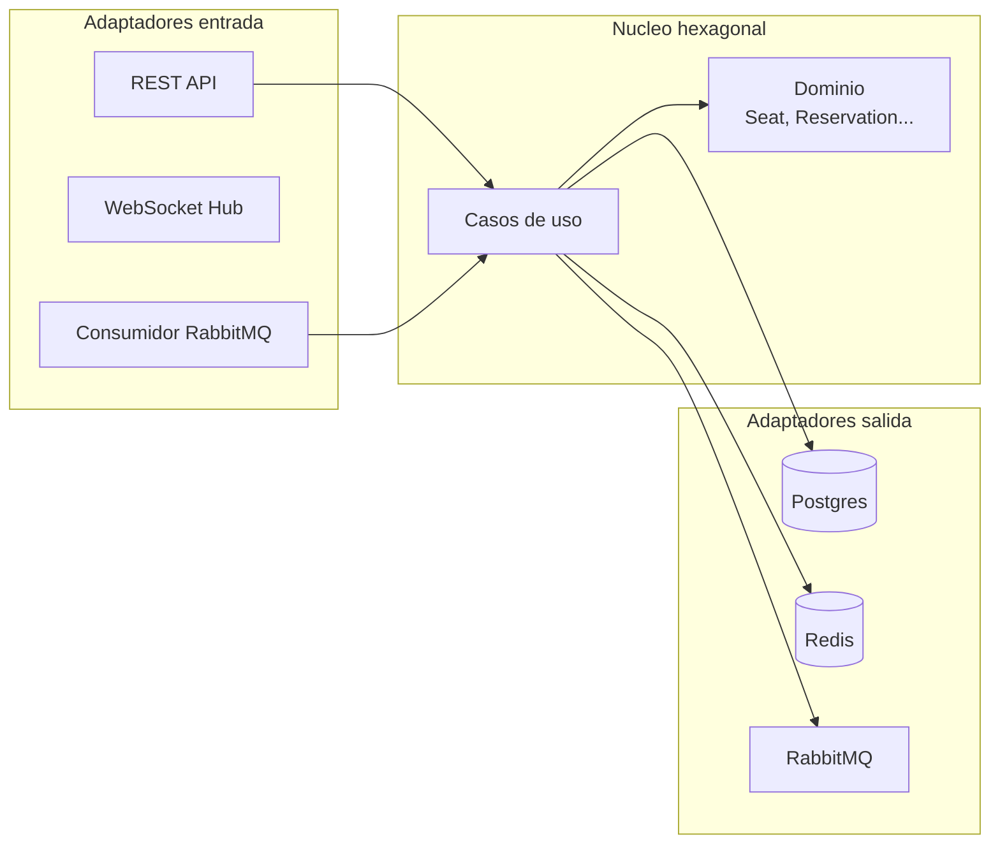
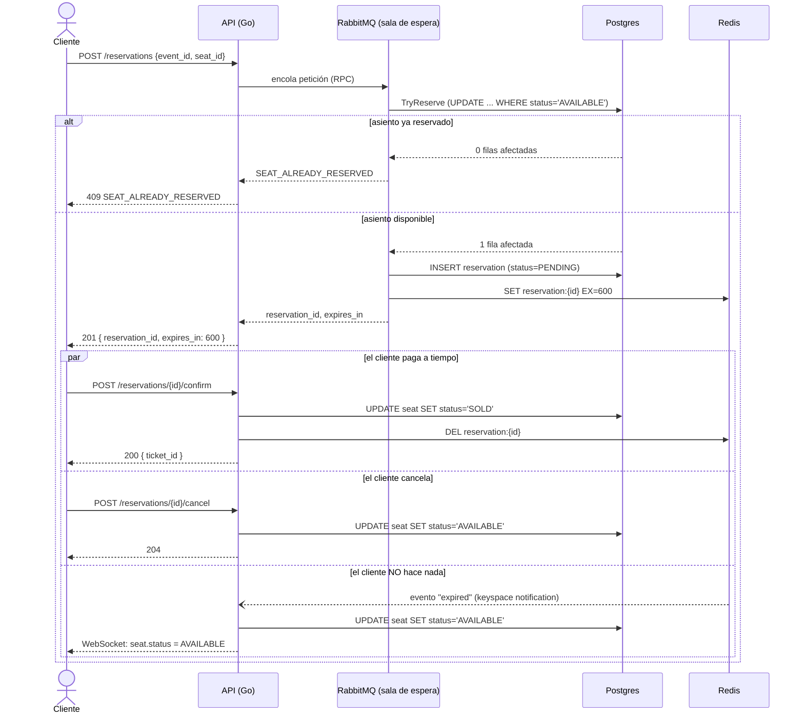

# Sistema de venta de entradas de alta concurrencia

Español · [English](./README.en.md)

Sistema de venta de entradas construido en Go con arquitectura hexagonal (DDD). Postgres con locks transaccionales atómicos garantiza que **un asiento jamás se vende dos veces**, incluso bajo carga concurrente real. Redis maneja el TTL de 10 minutos de cada reserva, RabbitMQ actúa como sala de espera virtual real (con workers consumiendo la cola, no solo un publisher decorativo), y WebSockets notifican los cambios de asiento en tiempo real. Frontend en Nuxt con mapa de asientos interactivo.

## Stack

| Capa | Tecnología | Por qué |
|---|---|---|
| API | Go (Golang) | Concurrencia nativa — el estándar en empresas como Glovo o Cabify para este tipo de sistema |
| Base de datos | PostgreSQL | Locks transaccionales estrictos: garantía real de no-doble-venta |
| Caché / TTL | Redis | Libera automáticamente un asiento si no se paga en 10 minutos |
| Mensajería | RabbitMQ | Sala de espera virtual: un pool de workers procesa las reservas a un ritmo controlado, no cada request tocando Postgres directo |
| Infraestructura | Podman | Todo el stack orquestado con contenedores (`Containerfile`, no Docker) |
| Documentación | OpenAPI + Swagger UI | Contrato de API interactivo y probable en el navegador |
| Frontend | Nuxt + pnpm | Mapa de asientos en tiempo real vía WebSockets, estética cyberpunk/neobrutalista |

## Arquitectura

Arquitectura hexagonal (puertos y adaptadores): el dominio (`Seat`, `Reservation`, `Event`, `Ticket`) no depende de Postgres, Redis, RabbitMQ ni HTTP — todo lo externo pasa por interfaces.



Detalle completo de capas y estructura de carpetas: [`ARCHITECTURE.md`](./ARCHITECTURE.md).

## Flujo de negocio: Reservar → Esperar 10 min → Pagar (o cancelar)



## Arrancar el proyecto

### Opción A — desarrollo (backend y frontend por separado, con hot-reload)

```bash
git clone https://github.com/carlosmorales-dev-mx/ticketing-system.git
cd ticketing-system

cp deploy/.env.example deploy/.env
make up                 # Postgres + Redis + RabbitMQ + Swagger UI
make tidy                # dependencias de Go
make frontend-install    # dependencias del frontend (pnpm)

make dev-full            # backend + frontend juntos, un solo comando/terminal
```

`make dev-full` levanta `go run` y `pnpm dev` en paralelo dentro de la misma terminal — `Ctrl+C` detiene ambos a la vez. Si prefieres verlos en terminales separadas: `make run` en una y `make frontend-dev` en otra.

- API: **http://localhost:8080**
- Frontend: **http://localhost:3000**
- Swagger UI: **http://localhost:8081**

### Opción B — todo containerizado (demo de un solo comando)

```bash
make up-full   # construye y levanta infra + API + frontend, todo en contenedores Podman
```

## Probar la garantía anti-doble-venta

Con el backend corriendo (`make run` o `make dev-full`):

```bash
make smoke-test
```

Dispara 15 peticiones de reserva **concurrentes** sobre el mismo asiento y verifica que exactamente una gane (`201`) mientras el resto recibe `409 SEAT_ALREADY_RESERVED` o `429` (rate limiting). Luego confirma el pago y valida que el asiento quede en estado `SOLD`.

## Tests

```bash
make test   # go test -race -cover ./...
```

Tests unitarios del dominio (`Seat.Reserve`, `Reservation.IsExpired`...) y del caso de uso `ReserveSeat` con fakes en memoria — la arquitectura hexagonal permite probar la regla anti-doble-venta sin levantar Postgres.

## Documentación adicional

- [`ARCHITECTURE.md`](./ARCHITECTURE.md) — estructura de carpetas, capas hexagonales, regla de dependencias
- [`api/openapi.yaml`](./api/openapi.yaml) — contrato completo de la API, casos de borde (`400`/`409`/`429`) y ejemplos
- [`deploy/README.md`](./deploy/README.md) — infraestructura, accesos y variables de entorno
